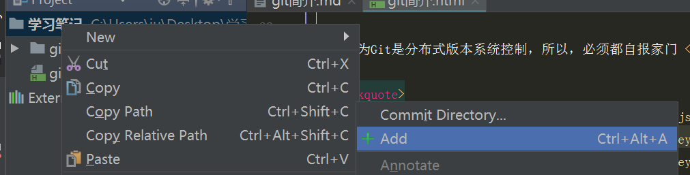
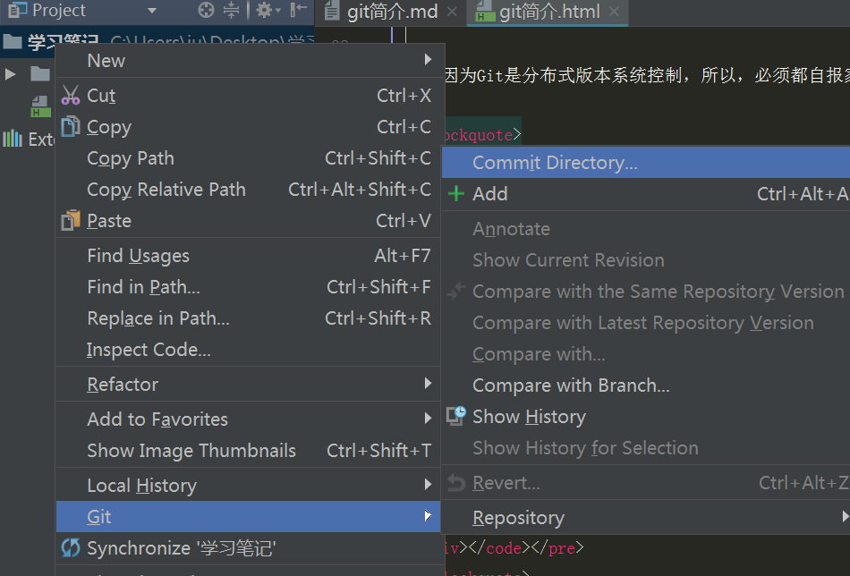
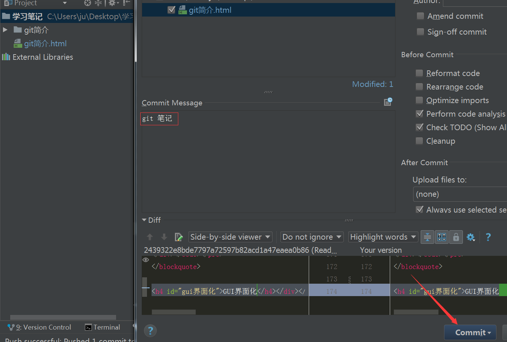
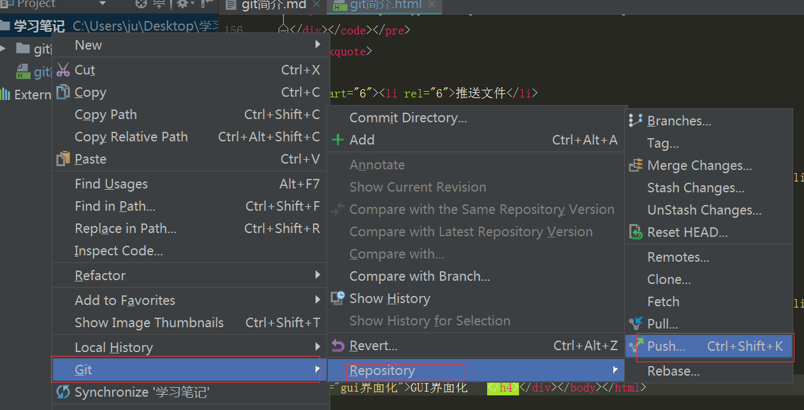
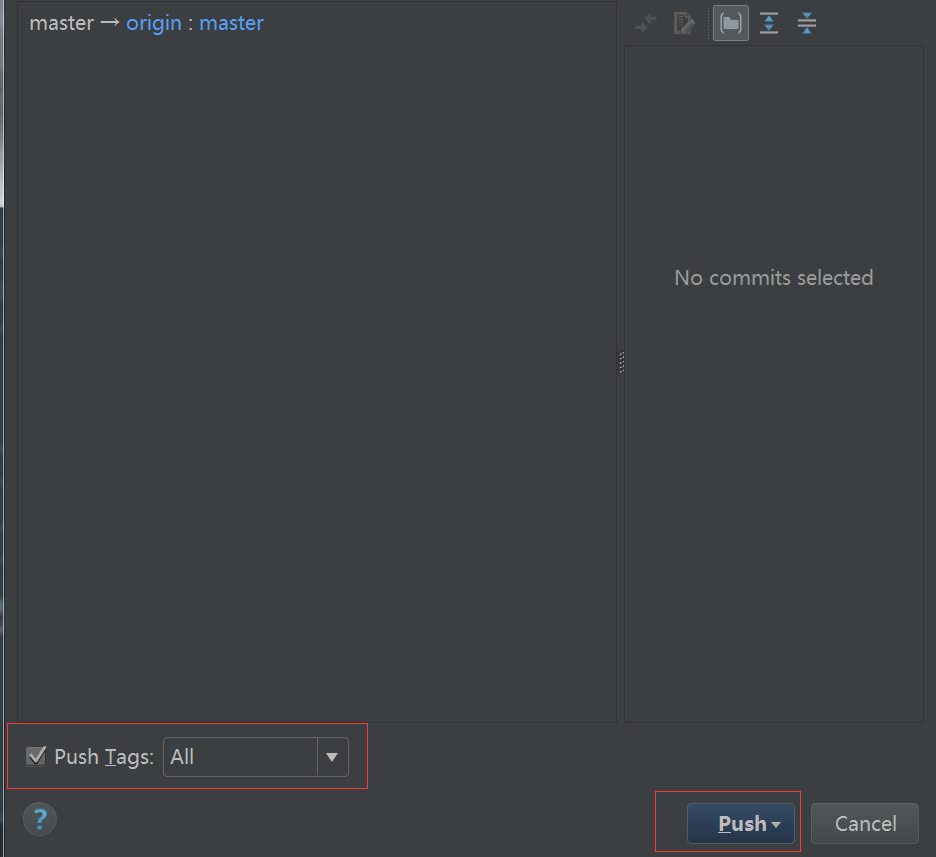

#git简介
#####1.git是什么
> 目前世界上最先进的分布式版本控制系统

####2.版本控制系统和集中式有什么区别
> `集中式版本控制系统` 集中放在中央服务器的 干活的时候，用的是自己电脑，要先从中央服务器获取最新的版本， 然后开始干活 ，干完了 再把自己干的活推送到中央服务器。
缺点：必须联网才能工作 并不利于团队开发 如果中央服务器发生了错误，  那么整个项目就报废了。
`分布式控制版本` 首先分布式控制系统根本没有“中央服务器” 每一个人的电脑都是一个完整的版本库 分布式系统安全性要高很多。具有强大的分支管理。
####3.安装Git
> Windows网址 http://git-scm.com
##### 配置用户（不配置用户不能提交代码）
因为Git是分布式版本系统控制，所以，必须都自报家门 
> ```
git config --list 
git config --global user.name "你的名字"
git config --global user.email "你的邮箱"
```

#####初始化Git（一个项目初始化一次 不能嵌套   初始化了一个仓库）
> ```
> git init 告诉git那个文件夹被git所管理
> git status 查看git状态
> ```
#####添加到暂存区（将文件添加到仓库 第一步）
第一步：用命令 git add告诉git 把文件添加到仓库 
> ```
> git add . /-A/文件名
> ```
#####添加到历史区（第二步）
-m后面输入的是本次提交的说明 可以输入任意内容，当然最好是有意义的
> ```
> git commit -m"备注消息"
> ```
##### 掌握工作区的状态 查看修改内容
######需求：如果我们修改了这个文件夹 怎么查看当前的状态
> ```
> git status 
> git status命令可以让我们时刻掌握当前的状态
> ```
######需求： 查看具体修改了什么内容
> ```
> git diff 
> 查看修改的内容后 依然是和提交新文件一样的二步 第一步添加到暂存 第二步 历史区 
> ```
#####工作区和暂存区和历史区
>  电脑里能看到的目录 例如一个文件夹就是一个`工作区` 
>  前面讲了我们把文件往Git版本库里添加的时候，是分两步执行的：
>  
> 第一步是用git add把文件添加进去，实际上就是把文件修改添加到暂存区；

> 第二步是用git commit提交更改，实际上就是把暂存区的所有内容提交到当前分支。

> 因为我们创建Git版本库时，Git自动为我们创建了唯一一个master分支，所以，现在，git commit就是往master分支上提交更改。
> 所谓的`暂存区` 实际上就是要提交的文件 和修改的文件通通放到暂存区 
> 那么`历史区` 就是当前的那个分支 
##### 撤销修改
> 场景1 当你改乱了工区取某一个文件的内容， 想要直接丢弃工作区的修改是 
> ```
> git checkout -- file
> ```
> 场景2  当你不但改乱了某一个文件的内容 还添加到了暂存区 想要丢弃 分二步
> ```
> git checkout 文件名
git reset HEAD 文件名 回到上一次的缓存区
> ```
> 场景3  如果你已经提交到了历史区 那么只能使用 回滚历史版本了
> ```
> git reflog 查看所有版本
> git reset --hard 版本号
> ```
#####添加远程库 （将本地文件放到GitHub上）
> 1.注册 登录 GitHub账号 
> 2.创建一个仓库
> 3.将本地文件存放在暂存区 
> 4.将本地文件存在在历史取（当前分支）上
> 5.关联远程库 
> ```
> git remote add origin 地址
> ```

6. 推送文件
> ```
> git push origin master 
> ```

 7.拉取最新的代码
> ```
> git pull origin master
> ```
> 


####GUI界面化





